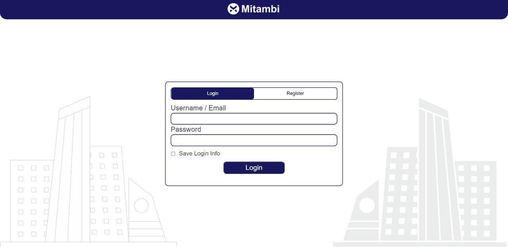
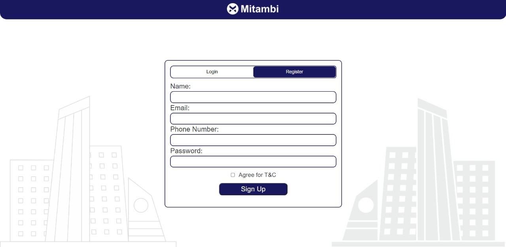
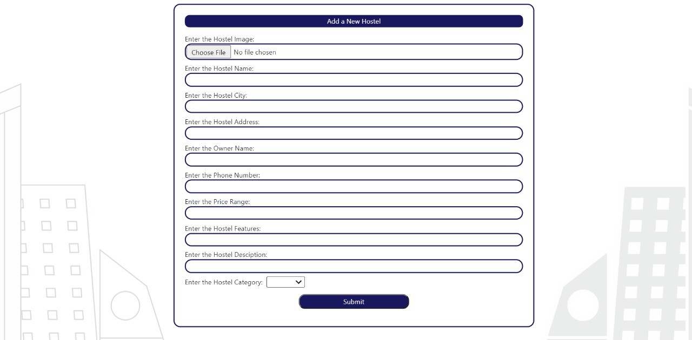
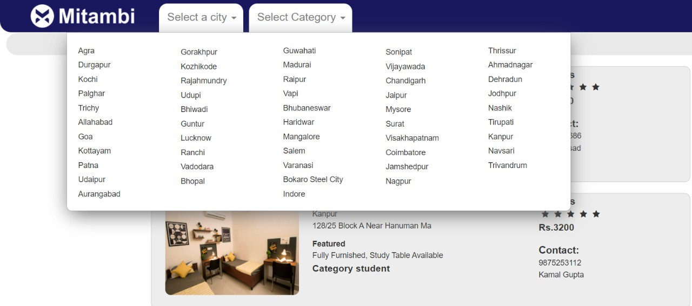

# Hostel Management System

The Hostel Management System is a web-based application that simplifies the management of hostels. It provides an efficient way to handle various hostel-related operations such as student registration, room allocation, fee management, and staff management.

